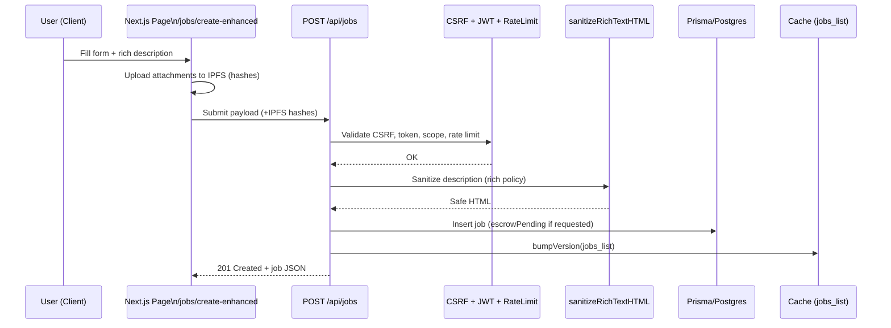
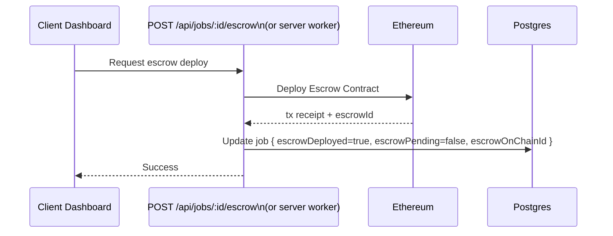

# Architecture Diagrams

This document captures the core data flows and components of the platform using Mermaid diagrams.

## 1) System architecture (high level)

```mermaid
flowchart LR
  subgraph Client
    A[Next.js App Router\nReact 19 + Tailwind]
    B[RainbowKit/wagmi\nWallet Auth]
    C[RichTextEditor\nreact-quill]
  end

  subgraph API
    D[/Route Handlers\n(src/app/api)\nZod, CSRF, JWT/Scopes/]
    E[Sanitization\n(sanitize-html)]
    F[Rate Limit]
    G[ServerTiming\n+ Metrics]
  end

  subgraph Services
    H[Prisma\nPostgreSQL]
    I[(Cache Layer)\nRedis | In-memory]
    J[IPFS]
    K[Ethereum\nEscrow/Rep/NFT]
  end

  A -->|fetch| D
  B -->|Bearer JWT| D
  C -->|HTML| E --> D
  D -->|read/write| H
  D -->|put/get| I
  D -->|upload/read| J
  D -->|tx/call| K
  D --> G
```

## 2) Job creation sequence (rich text + IPFS + escrow intent)



## 3) Jobs list with caching and metrics


## 4) Simplified data model (ERD)

```mermaid
erDiagram
  USER ||--o{ PROFILE : has
  USER ||--o{ JOB : posts
  USER ||--o{ APPLICATION : submits
  JOB ||--o{ APPLICATION : receives

  USER {
    string id
    string username
    string walletAddress
    enum userType
  }
  PROFILE {
    string userId
    string title
    string bio
    string[] skills
    float hourlyRate
    float rating
    int completedJobs
    string avatar
    int experience
  }
  JOB {
    string id
    string clientId
    string title
    string description(HTML)
    float budgetAmount
    enum budgetType(FIXED|HOURLY)
    string currency
    string[] skills
    datetime createdAt
    datetime deadline
    bool useBlockchain
    bool escrowPending
    bool escrowDeployed
    int escrowDeploymentAttempts
    string escrowOnChainId
  }
  APPLICATION {
    string id
    string jobId
    string freelancerId
    string coverLetter
    datetime createdAt
  }
```

## 5) Escrow deployment path (happy path)



## 6) Observability flow

```mermaid
flowchart TB
  A[Incoming Request] --> B[withLatency wrapper]
  B --> C[Route Handler]
  C --> D[ServerTiming measurements]
  C --> E[Cache events\n(hit/miss/version)]
  C --> F[App events\n(success/error)]
  D --> G[Server-Timing header]
  E --> H[Metrics UI\nAdmin Dashboard]
  F --> H
```

---

Tip: These Mermaid blocks render directly in many viewers (including GitHub). If you want PNGs/SVGs for docs, we can export them or generate an SVG assets folder.

## 7) Applicant workflow (apply → shortlist → award → fund escrow)

```mermaid
sequenceDiagram
  participant FR as Freelancer FE
  participant CL as Client FE
  participant API as /api/jobs & /api/applications
  participant SEC as CSRF + JWT + RateLimit
  participant DB as Postgres
  participant CHN as Ethereum (Escrow)

  Note over FR: Browse job details
  FR->>API: GET /api/jobs/:id
  API-->>FR: Job JSON
  FR->>API: POST /api/applications { jobId, coverLetter }
  API->>SEC: Validate (CSRF/JWT/rate limit)
  SEC-->>API: OK
  API->>DB: Create application (status=pending)
  API-->>FR: 201 Created

  Note over CL: Review candidates
  CL->>API: GET /api/jobs/:id/applications
  API-->>CL: List of applications
  CL->>API: PATCH /api/applications/:id { status: shortlisted }
  API->>DB: Update application

  alt Client awards job
    CL->>API: PATCH /api/applications/:id { status: awarded }
    API->>DB: Mark awarded; link to job
    CL->>CHN: Fund escrow (amount)
    CHN-->>CL: tx receipt
    API->>DB: Update job { escrowDeployed/OnChainId when available }
  end
```

## 8) Dispute resolution (high-level)

```mermaid
flowchart LR
  subgraph Client Side
    A[Client FE]
    F[Freelancer FE]
  end
  subgraph Server
    API[/API: disputes endpoints/]
    DB[(Postgres)]
  end
  subgraph Chain
    ESC[Escrow Contract]
    ARB[Arbitration Logic\n(on/off-chain policy)]
  end

  A -- open dispute --> API
  API --> DB
  API -- pause/refer --> ESC
  ESC --> ARB
  ARB -- resolution event --> ESC
  ESC -- payout split --> F
  ESC -- refund/partial --> A
  ESC --> API
  API --> DB
  API -- notify --> A
  API -- notify --> F
```
